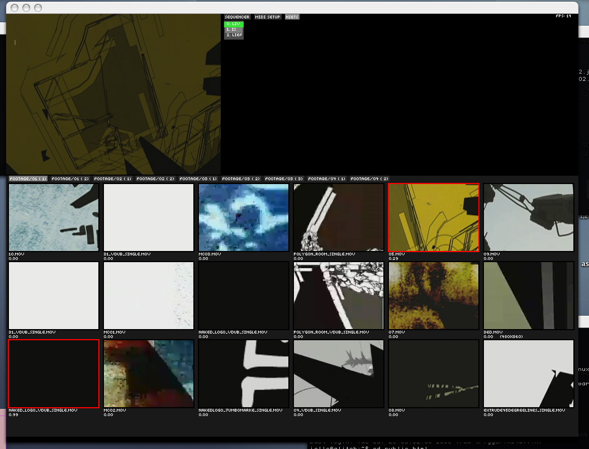

# pyvid

based on a three day hack, comes this three day
rewrite. This little app can trigger quicktime clips via MIDI.
All it does is the following,

- load quicktime clips
- start clip on midi note on
- stop clip on midi note off
- set clip opacity on aftertouch and velocity messages
- has a little gui

## Manual

- There is a manual (sort of), [here](manual.html)

## Source code

It is written in C++ and python, and compiles on windows and
mac. For video decoding QuickTime is used. Video display is
done with SDL. The low-level bits are C++ and the high level
interface to python is via SWIG. MIDI interfaces are queried
using the [RtMidi](http://www.music.mcgill.ca/~gary/rtmidi/)
library.

To see how simple this is, have a look at the
main python source [`pyvid.py`](src/pyvid.py).

The source code used to be highlighted with [GNU
Source Highlite](https://www.gnu.org/software/src-highlite/),
but Github does a great job, so we don't bother anymore.

## Download PPC app

- [`pyvid.app.zip`](pyvid.app.zip)
