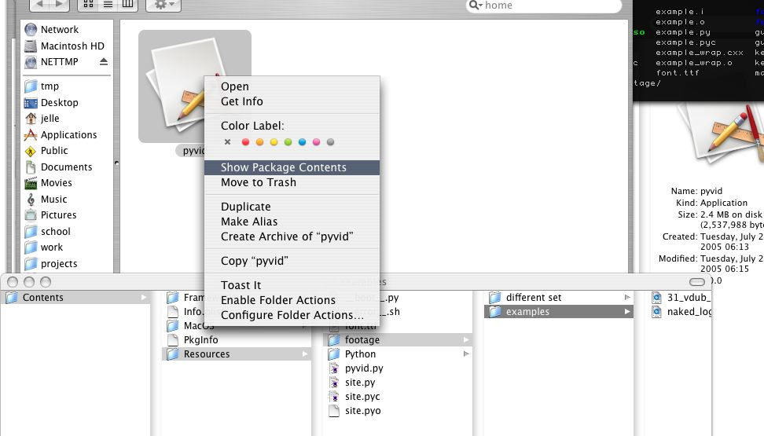
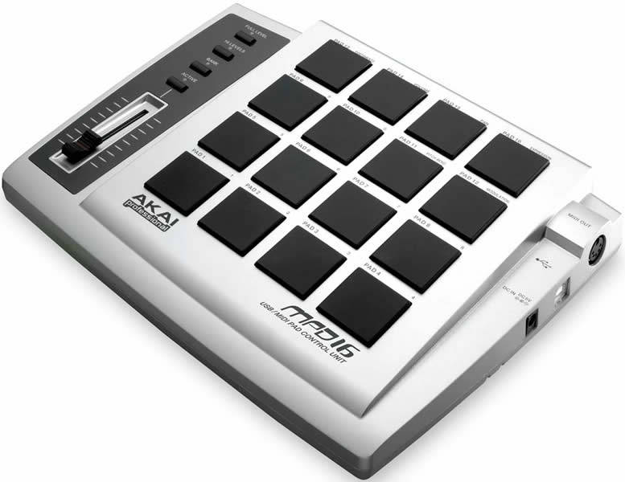

> This application is written in July, 2005.
> It doesn't run on modern systems, sorry :-(a

# pyvid

based on a three day hack, comes this three day
rewrite. This little app can trigger quicktime clips via MIDI.
All it does is the following,

- load quicktime clips
- start clip on midi note on
- stop clip on midi note off
- set clip opacity on aftertouch and velocity messages
- has a little gui

## Manual

Sort of...

#### Footage

pyvid eats quicktime footage, resolution must be 384 x 288.

To insert extra footage, do the following.
- `alt-click` on `pyvid.app`,
- select "show package contents".
- Browse to `Contents/Resources/footage/`.
- Create folders and insert footage there.

Every folder becomes a set, with one or more pages.
Every 18 files (recursively) become one page.
The File extension must be `.mov`.

#### Keyboard shortcuts

- `left`/`right` — select top left panel
- `up`/`down` — change selected list/track
- `return` — activate selection
- `1` - `9`, `0` — browse to available sets
- `esc` x 2 (quickly) — exit application

#### MIDI

This works well with Akai MPD-16 MIDI drum pads,
or similar.

## Source code

It is written in C++ and python, and compiles on windows and
mac. For video decoding QuickTime is used. Video display is
done with SDL. The low-level bits are C++ and the high level
interface to python is via SWIG. MIDI interfaces are queried
using the [RtMidi](http://www.music.mcgill.ca/~gary/rtmidi/)
library.

To see how simple this is, have a look at the
main python source [`pyvid.py`](src/pyvid.py).

The source code used to be highlighted with [GNU
Source Highlite](https://www.gnu.org/software/src-highlite/),
but Github does a great job, so we don't bother anymore.

## Download PPC app

This binary only works on Powermacs running an old version
of OS X with Quicktime, I think around 10.4 range.

- [`pyvid.app.zip`](pyvid.app.zip)
